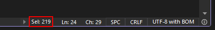

[marketplace]: https://marketplace.visualstudio.com/items?itemName=MadsKristensen.DocumentMargin
[vsixgallery]: http://vsixgallery.com/extension/DocumentMargin.a5a7bd52-f250-4930-83b4-2085f8b9c7de4/
[repo]:https://github.com/madskristensen/DocumentMargin

# Editor Info extension for Visual Studio

Download this extension from the [Visual Studio Marketplace][marketplace]
or get the [CI build][vsixgallery].

----------------------------------------

> Inspired by [a popular Visual Studio feature request](https://developercommunity.visualstudio.com/t/Code-Editor-Horizontal-Scroll-Bar-Displa/10514754) on Developer Community.

This extension adds a margin to the editor that displays the text length, selection length, and total number of lines in the file. It also shows the encoding of the of the file and let you easily change it.

When you select text, the margin will display the number of selected characters.

Clicking the encoding indicator will open a drop down menu that lets you change the encoding of the file.

The file isn't saved automatically with the newly selected encoding. You must save the file manually (`CTRL+S`) to apply the new encoding.

## How can I help?
If you enjoy using the extension, please give it a ★★★★★ rating on the [Visual Studio Marketplace][marketplace].

Should you encounter bugs or if you have feature requests, head on over to the [GitHub repo][repo] to open an issue if one doesn't already exist.

Pull requests are also very welcome, since I can't always get around to fixing all bugs myself. This is a personal passion project, so my time is limited.

Another way to help out is to [sponsor me on GitHub](https://github.com/sponsors/madskristensen).